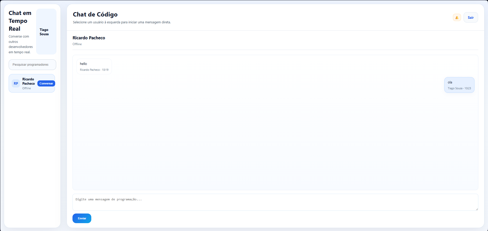

# realtime_chat

Chat em tempo real em PHP com XAMPP.

## Funcionalidades

- Login e registro
- Envio de mensagens
- Página de chat
- API simples

## Como usar

1. Abra o XAMPP
2. Coloque o projeto em `htdocs`
3. Acesse `http://localhost/realtime_chat`

# Realtime Chat

